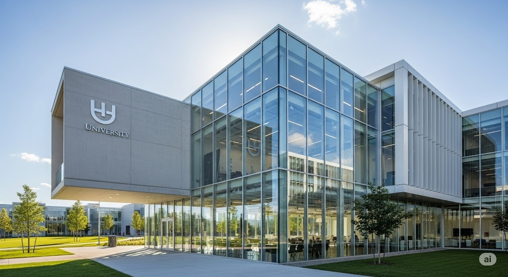

# NovaTech Event Registration Portal 🚀



## 🌟 Overview

**NovaTech** is a premium, high-fidelity event registration portal designed for modern university tech fests. Built with **React** and **Vite**, it features a "Cyber-Luxury" aesthetic with glassmorphism effects, interactive animations, and a seamless user experience.

The platform allows students to:
- 📅 Register for **General Events** (Cultural Fests, Guest Lectures).
- 🚀 Sign up for **Techfest '26** competitions (Hackathons, RoboWars) with team management.
- 🤝 Apply for **Organizing Committee** roles.

## ✨ Key Features

- **Interactive UI**:
  - Smooth transitions and scroll-to-section interactions.
  - "Featured Opportunities" cards with hover effects and automatic tab switching.
  - Glassmorphic design system with neon glows and modern typography.

- **Dynamic Forms**:
  - Context-aware forms that change fields based on the selected category (General vs. Tech vs. Organize).
  - **Team Management**: Visual team size selectors (Solo, Duo, Quad).
  - Real-time state management and validation.

- **Success Feedback**:
  - Custom modal with **Confetti Celebration** animations upon successful registration.
  - Loading states and feedback for user actions.

- **Responsive Design**: Fully optimized for desktops, tablets, and mobile devices.

## 🛠️ Tech Stack

- **Framework**: React 18 + Vite
- **Styling**: Native CSS Variables + Utility Classes (Tailwind-inspired)
- **Icons**: `lucide-react`
- **Animations**: CSS Keyframes + `canvas-confetti`
- **Fonts**: Inter / DM Sans

## 🚀 Getting Started

1.  **Clone the repository**
    ```bash
    git clone https://github.com/yourusername/novatech-portal.git
    cd novatech-portal
    ```

2.  **Install dependencies**
    ```bash
    npm install
    ```

3.  **Run the development server**
    ```bash
    npm run dev
    ```

4.  **Build for production**
    ```bash
    npm run build
    ```

## 📂 Project Structure

```
src/
├── assets/            # Local images (Hero, Featured Cards)
├── components/
│   ├── Navbar.jsx     # Sticky navigation with "NovaTech" branding
│   ├── Hero.jsx       # Landing section with background image and localized buttons
│   ├── RegistrationSection.jsx  # Main form logic with 3 distinct modes
│   ├── FeaturedOpportunities.jsx # Interactive cards section
│   └── SuccessModal.jsx         # Popup completion modal
├── index.css          # Global styles, variables, and animations
└── App.jsx            # Main layout and routing logic
```

---

*Empowering the Future. Built for NovaTech '26.*
